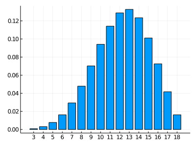

<p>
  
</p>

# DiceRolls.jl

_This package defines dice and operations with them._


[![GitHub](https://img.shields.io/github/release/abelsiqueira/DiceRolls.jl.svg?style=flat-square&logo=data:image/png;base64,iVBORw0KGgoAAAANSUhEUgAAAA4AAAAOCAMAAAAolt3jAAAB+FBMVEUAAAA3lyU3liQ4mCY4mCY3lyU4lyY1liM3mCUskhlSpkIvkx0zlSEeigo5mSc8mio0liKPxYQ/nC5NozxQpUBHoDY3lyQ5mCc3lyY6mSg3lyVPpD9frVBgrVFZqUpEnjNgrVE3lyU8mio8mipWqEZhrVJgrVFfrE9JoTkAVAA3lyXJOjPMPjNZhCowmiNOoz1erE9grVFYqUhCnjFmk2KFYpqUV7KTWLDKOjK8CADORj7GJx3SJyVAmCtKojpOoz1DnzFVeVWVSLj///+UV7GVWbK8GBjPTEPMQTjPTUXQUkrQSEGZUycXmg+WXbKfZ7qgarqbYraSVLCUV7HLPDTKNy7QUEjUYVrVY1zTXFXPRz2UVLmha7upeMCqecGlcb6aYLWfaLrLPjXLPjXSWFDVZF3VY1zVYlvRTkSaWKqlcr6qesGqecGpd8CdZbjo2+7LPTTKOS/QUUnVYlvVY1zUXVbPSD6TV7OibLuqecGqecGmc76aYbaibLvKOC/SWlPMQjrQUEjRVEzPS0PLPDL7WROZX7WgarqibLucY7eTVrCVWLLLOzLGLCLQT0bIMynKOC7FJx3MPjV/Vc+odsCRUa+SVLCDPaWVWLKWWrLJOzPHOTLKPDPLPDPLOzLLPDOUV6+UV7CVWLKVWLKUV7GUWLGPUqv///8iGqajAAAAp3RSTlMAAAAAAAAAAAAAABAZBAAAAABOx9uVFQAAAB/Y////eQAAADv0////pgEAAAAAGtD///9uAAAAAAAAAAcOQbPLfxgNAAAAAAA5sMyGGg1Ht8p6CwAAFMf///94H9j///xiAAAw7////65K+f///5gAABjQ////gibg////bAAAAEfD3JwaAFfK2o0RAAAAAA4aBQAAABEZAwAAAAAAAAAAAAAAAAAAAIvMfRYAAAA6SURBVAjXtcexEUBAFAXAfTM/IDH6uAbUqkItyAQYR26zDeS0UxieBvPVbArjXd9GS295raa/Gmu/A7zfBRgv03cCAAAAAElFTkSuQmCC)](https://github.com/abelsiqueira/DiceRolls.jl/releases)
[](https://travis-ci.org/abelsiqueira/DiceRolls.jl)
[]()
[](https://abelsiqueira.github.io/DiceRolls.jl/stable/)
[](https://abelsiqueira.github.io/DiceRolls.jl/dev)

---

This package defines dice and some operations with them. We recommend looking into the docs for a better description of what you can do. As a simple example, here is the distribution of the tradicional ability score roll on Dungeons and Dragons, i.e., rolling 4 six-sided dice, removing the lowest and summing the result.

```julia
using DiceRolls, Plots

begin
  v, f = DiceRolls.histogram(drop(4d6), normalize=true)
  Plots.bar(v, f, size=(400,300), leg=false)
  xticks!(v)
  png("4d6D1")
end
```


